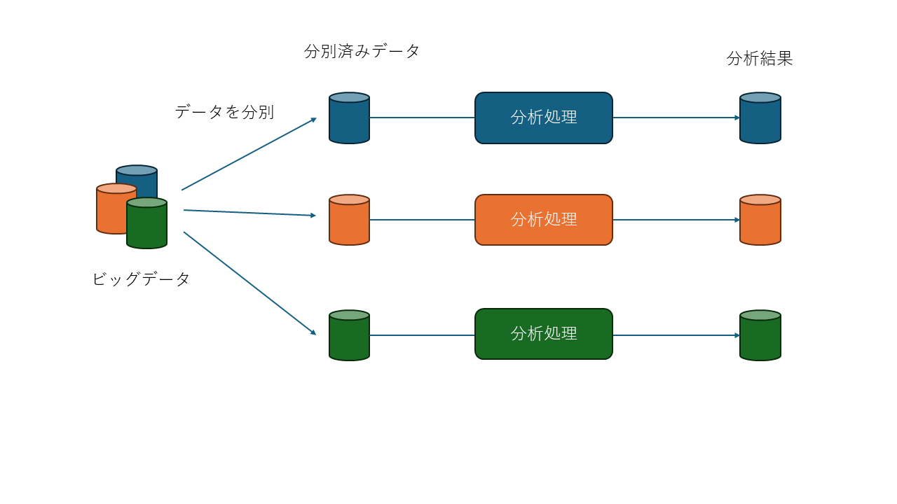

# 大規模データ処理の基本

本章ではなぜ大規模データ処理が必要なのか、どの様な概念で動作しているかについて説明します。

## 大規模データ処理の必要性

コンピューターの性能は年々高くなってきてはいますが、コンピューターで処理を行うデータ量も増えてきています。
１台のコンピューターで処理できるデータ量には限界があり必要な計算を１台のコンピュータでは行うことができなくなってきています。  
そこで、同じ処理を複数台のコンピューターを利用して計算をすることにより、目標となる時間内に計算を完了させることが必要になりました。  
この目標時間内に複数のコンピュータリソースで計算を行う為のフレームワークとして有名なのがhadoopやkafkaと言ったプラットフォームです。
特徴はそれぞれ異なりますが、大きな概念は同じです。

## 大規模データ処理の概念

大規模のデータを分散処理を行う場合、「データの分別」を行ったあとに「データ処理」を行います。  
データの分別は、データ一つ一つにキーを追加します。同じキーを纏めたデータの集合体をデータ処理を行うサーバに送ります。  
同じキーを持つデータは同一のサーバに送られデータ処理を行います。この動作は非常に重要で、前後の関連性を計算する場合に役に立ちます。  
例えば、店舗ごとの売上の合計を計算する場合など、店舗IDをキーにすることで同じ店舗のデータが同じデータ処理サーバに送られるので 他のデータを確認する必要がなくなり結果を出すことができます。  
逆に言うと、データをまとめる単位ごとに同じキーにしないとうまく分散することができなくなるので注意です。

:::note
画像はデータを中心とした概念図です。
実際のデータ処理には複数のデータを組み合わせることが多くもっと複雑になっています。他のサイトではデータを分別するところから処理するところの矢印がメッシュ状に描かれていることが多いですが、それらの図は処理フロー中心にしたフロー図になり抽象化の仕方が異なります。
:::

## データについて

データは１つ１つをメッセージと呼ぶ単位で保存を行います。その中に３つの情報が入ります。１つはメッセージの内容であるBody(Valueとも呼ばれる）。データの分別元となる情報のキー。それと処理状況を保存するHeader(Meta dataとも呼ばれる）があります。ユーザは、BodyにKeyを付けてメッセージとしてデータ処理プラットフォームへ送ります。送られたメッセージは、仕分処理が行われデータ処理のプログラムへ渡されます。そして、データ処理プログラムは結果を出力します。
結果と言っても、データ処理プログラムは並列で処理を行っており、並列の個数だけ結果出力があるため、最終的な結果（合計値や平均値のような値を求める場合）はそれぞれの結果を集めて計算する必要があります。

