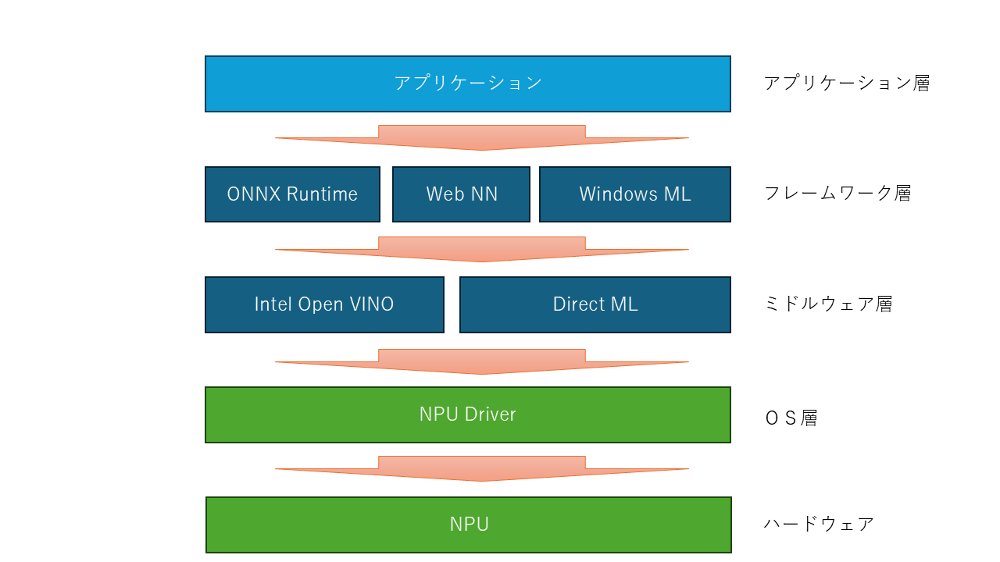

# Intel NPUとは

Intel Core Ultra シリーズに搭載されているニューラルプロセッシングユニットのことで、主にAI処理に優れる計算ユニットのことです。  
簡単に言うと、GPUと同じ行列計算を非常に高速に行える機構ですが、GPUがグラフィック用途に設計されているのに対して、NPUはAI処理用に設計されより最適化されています。

## Intel NPUを扱いかたの概要

少し語弊は有りますが、アプリケーションがNPUを利用する場合、AIフレームワークのAPIを叩きます。  
AIフレームワークは、学習されたモデルに従い、ミドルウェア層のAPIを叩き行列計算を行います。
ミドルウェアは、行列処理を最適化して適切なハードウェアの選定を行い、カーネルへ命令を出します。
カーネルは、ハードウェアへ計算命令を出し、結果を返し、最終的に結果が出力されます。

## Intel NPUがサポートしているライブラリ

* ONNX Runtime (オニキスランタイム)  
オープンソースの機械学習やディープラーニング用モデル処理を行うランタイム

* WebNN
WebのバックエンドAPIで主にWebブラウザからAI処理を行うためのもの。ONNXと併用されることが多い

* WindowsML
WindowsのAPIでWindowsアプリケーションからAI処理を行うためのもの

* DirectML
Widowsn内で機械学習向けの低水準API。ハードウェアの差異を吸収して処理を行うためのミドルウェア

* Intel Open VINO  
Intelが提供する機械学習向け低水準API。DirectMLがWindowsを基本としているが、こちらはWindowsとUbuntu上で動作する

## 本書では

上記以外に、NPUに直接命令を行う[Intel® NPU Acceleration Library](https://intel.github.io/intel-npu-acceleration-library/)があります。
こちらを中心に解説していきます。

