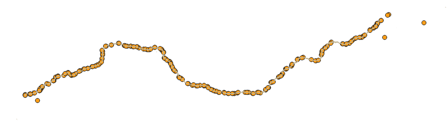

# OSMファイルのフィルター

OSMファイルは非常に多くの地図データを含んでおりとても有益です。
正しくフィルターを行うことで、自分のオリジナルな地図を作成したり、地図上からデータを抽出することが出来ます。  
ただし、フィルター自体のコマンドは簡単ですが、実際に欲しいデータを抽出することは経験が必要なほど難しいです。  
ここでは、簡単なコマンドの利用法と必要なデータの抽出方法を簡単に紹介します。

## OSMデータをフィルターを行う方法

OSMデータのフィルターには、`osmfilter`コマンドを利用する方法を紹介します。  
このコマンドは、xml形式のosmファイルに対してフィルターを行います。

## フィルター例

### 高速道路のデータ抽出

osmfileter コマンドは、--keep　オプションを利用することで属性を指定して抽出することが可能です。
osmの属性には、TAGに`highway=motorway`属性を追加されています。この属性のみを抽出する場合以下のようなコマンドを入力します。

```
osmfilter japan-latest.osm --keep="highway=motorway" -o japan_highway.osm
```

japan-latest.osm は入力ファイルです。  
--keep でtagのhighway=motorway を指定しています。  
-o 主強くファイルを指定します。

東名高速道路を抽出する場合はフィルターを`ref:E1`にすることで抽出可能です。
上記のフィルタを行った後に、再度フィルタをするか `highway=motoway and ref:E1`のように２つの条件を満たすフィルタを指定することで抽出できます。

ref:E1だけでフィルターをすると、高速道路以外のデータが混入するので注意です。試すと以下のように高速道路以外のポインタが含まれていました。



