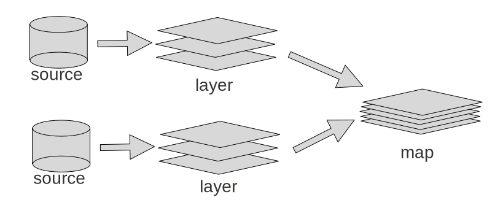

# Maplibre ソースとレイヤーの概念について

Maplibreで地図表示をカスタマイズするためには、ソースとレイヤーの概念の知っておく必要があります。
本章では、ソースとレイヤーの概念の利用方法について簡単に解説します。

## ソースとは

ソースとは、地図を表すデータのことです。
データは、画像ファイルだったり、Json形式の地図情報(GEOJSON)だったり、と様々な形式で提供されます。
それらの情報元をソースとしてレイヤーを構築します。

## レイヤーとは

ソースから作成された一時的な画像データです。
航空写真などの写真もあれば、ソースから抽出した道路の線画像、河川の画像、鉄道の線路の線画像等の様々な情報毎に切り分けられた画像です。
これらの画像を重ね合わせることで、ブラウザ上に地図データを表示します。

# ソースとレイヤーの利点

ソースとレイヤーに分かれているため、複数のソースから抽出したデータを重ねやすくなっています。
例えば、年代別の地図データを重ねることで、新しく作られた道を表示することが出来たり、航空写真の上に道を重ねたりすることができます。
また、表示したくない情報は非表示にすることができます。地図上の表示上の文字を消したり、道路を消して鉄道のみを表示するなんてこともできます。

