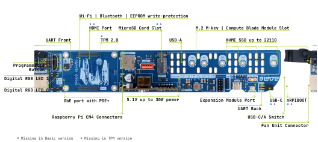

# Compute Blade

1Uの19インチラックに20台のraspberry pi CM4/5 を搭載可能なブレードサーバを紹介します。

尚、このページは、[メーカのGithub](https://github.com/Uptime-Lab/compute-blade)から一部の転用しています。
Gibhub上のライセンスが[Attribution-ShareAlike 4.0 International](https://creativecommons.org/licenses/by-sa/4.0/deed.ja)を利用しているため、本ページもライセンスに従い[Attribution-ShareAlike 4.0 International](https://creativecommons.org/licenses/by-sa/4.0/deed.ja)を利用します。

## 概要

アメリカのUptime Industries社から発売しているブレード型モジュールです。2025年9月現在は3種類のボードが用意されており、冷却用のヒートシンクとファンをセットで販売されています。（単体でも購入可能）
面白いのは、ブレード・ファン・ブレードランナー、オプションモジュールの４つを組み合わせて１つのブレードサーバを作成するようになっています。電源は販売されておらずPoEを利用してLAN側から供給する仕組みです。

## ブレードの紹介

ブレードの種類は、DEV/TPM/Basicの３種類あります。（写真はDEVのものです。）  
Basicが一番シンプルで、標準的な機能を備えています。  
TPMはBasicにTPM 2.0対応チップが搭載されておりセキュリティ強化版です。ビジネスで利用するためには必要なモデルだと考えます。  
DEVは、TPMにさらにデバッグ用のHDMIやUSB-C受電ポート/マイクロSDカードスロットを搭載し、ブレードサーバのセットアップ、作り込み時や画面投影などのデバック機能を追加しています。実物を見ていないので判断は確実ではありませんが、シャーシ搭載時はHDMIやUSB-Cポートはシャーシに塞がれてしまい利用できないように見えます。

基本セットは、Devを１枚にほかは、Basicを利用することが多いと思います。

## ファンの紹介

このブレードには専用のFANモジュールが２種類あります。SmartとStandardと名称がついています。
１つのファンに対して、２つのブレードがGPIOまたはUARTで接続する仕組みになっています。

Smart FANはRP2040(raspberry pi pico)が搭載されており、UARTを利用して様々な情報交換をすることができるようになっています。  
StandardはPWMファンがついているだけのものになります。PWMだけでもFANコントロールは十分できるのでこちらのモジュールでも十分な機能を発揮できるのではと思います。

## ブレードランナー

ブレードランナーは３種類用意されていますが、販売しているは２種類のみでした。

19インチラック用 20ブレードランナー  
4ブレードランナー  
2ブレードランナー(3Dプリンター用データのみ提供)

ブレードとファンをセットする仕組みになっています。搭載数以外の特徴はあまりなかったですが、お試しは４ブレードランナーを購入してから必要に応じて選択する感じかなって思いました。

## オプションモジュール

RTC/AI/セキュリティの３種類のモジュールが用意されていました。

RTCモジュール サードベンダー製のRTCモジュールを搭載可能でした。個人的にはNTP同期すれば必要ないものの認識ですが、ネットにつながらない環境でも時刻を保存できるなどメリットは多くあるので必要に応じて利用するものです。

AIモジュール 2025年9月現在開発中ですが、M.2 スロットに搭載するAIプロセッサーのようです。RTCのサービスピンも使うので成約も大きくなりそうですが、Raspberry Piを利用した少電力並列コンピューティングには最適になるのではと思います。

セキュリティモジュール サードパーティ製のモジュールが搭載可能ですが、TPMと機能が重複する部分が多いのでBasicモジュールを購入後にセキュリティ機能を強化したいときに利用するもののようです。  

:::info
個人的には興味がありますが、日本での販売はなさそうです。海外のサイトから発送は可能なようなので興味がある人は購入してみるのも良いと思います。

購入は下のリンクから可能です。  
[購入サイト](https://computeblade.com/buy-computeblade/)

:::
